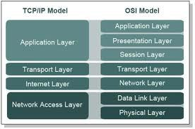

## Latar Belakang Masalah :
1.	Definisi OSI dan TCP/IP
2.	Fungsi 7 Layer OSI
3.	Fungsi 4 Layer TCP/IP
4.	Perbedaan Protokol TCP dan UDP

## Definisi OSI dan TCP/IP
OSI (Open System Interconnection) adalah konsep ideal bagaimana interkoneksi jaringan dilakukan, jadi standar komunikasi didalam jaringan menggunakan OSI layer. Layer adalah lapisan dan fungsinya untuk mempermudah pembelajaran. Jadi, OSI layer adalah konsep paling ideal, karena paling ideal jadi tidak bisa diterapkan didunia nyata, makanya layer yang digunakan sekarang itu bukan OSI layer.
Protokol yang kebanyakan digunakan sekarang adalah TCP/IP. Arsitektur TCP/IP tidaklah berbasis layer referensi tujuh lapis OSI, tetapi TCP/IP mengimplemenasikan arsitektur berlapis yang terdiri atas empat lapis.

## Fungsi 7 Layer OSI :
* Application Layer befungsi sebagai interface aplikasi dengan funsionalitas jaringan, atau pada layer inilah user berinteraksi dengan jaringan. Contoh : HTTP, FTP, POP3 dll.
* Presentation Layer berfungsi untuk menerjemahkan data yang akan ditransmisikan aplikasi agar dapat mejadi format yang dapat ditransmisikan melalui jaringan. Contoh : RDP, VNC dll.
* Session Layer berfungsi menjelaskan bagaimana koneksi bisa dibuat, dipelihara dan dihancurkan. Contoh : Net BIOS, PAP dll.
* Transport Layer berfungsi memecahakan dan mengurutkan data ke paket-paket sehingga paket tersebut bisa disusun kembali saat diterima. Contoh : TCP dan UDP.
* Network Layer berfungsi untuk memproses pengalamatan secara logika. Contoh : IP, ARP dll.
* Data Link Layer berfungsi untuk memproses pengalamatan secara fisik. Contoh : PPP, SLIP dll.
* Physical Layer berfungsi untuk mengirim bit bit data dan menjaga kondisi fisik antar sistem.

## Fungsi 4 Layer TCP/IP :
* Application Layer berfungsi untuk menyediakan layanan pada software-software yang berjalan pada computer. Contoh : HTTP, FTP, POP3 dll.
* Transport Layer berfungsi memecahakan dan mengurutkan data ke paket-paket sehingga paket tersebut bisa disusun kembali saat diterima. Contoh : TCP dan UDP.
* Internet Layer berfungsi sebagai penyedia IP untuk proses pengalamatan di suatu jaringan. Contoh : TCP/IP.
* Network Acces Layer berfungsi menjelaskan protocol dan hardware apa saja yang digunakan saat proses pengiriman data. Contoh : PPP, Ethernet dll.

## Perbedaan Protokol TCP dan UDP
TCP paket data yang dikirim harus komplit, misalnya paket data yang dikirim 10 maka yang harus sampai juga 10, sedangkan UDP paket datanya tidak harus komplit, misalnya paket yang dikirm 10 maka bisa jadi yang sampai Cuma 6 atau 7 dikarenakan untuk kepentingan fungsionalitas aplikasinya. Contoh aplikasi yang memakai protocol UDP : Skype, Video Call, dll.

## Kesimpulan
Jadi, OSI layer merupakan konsep yang paling ideal untuk komunikasi didalam jaringan dan susah untuk diterapkan. Makanya sekarang kebanyakan orang menggunakan protocol TCP/IP. Disini juga kita jadi lebih paham apa fungsi dari setiap layer yang ada di OSI layer dan TCP/IP layer dan juga perbedaan dari protocol TCP dan UDP.

## Saran
Mudah-mudahan pembelajaran matakuliah keamanan jaringan di pertemuan berikutnya sudah melakukan praktikum agar ilmu yang didapatkan menjadi lebih mendalam.

Nama : Bayu Rahmad Azhari
NPM : 1144125
Kelas : 3C
Prodi : D4 Teknik Informatika
Kampus : Politeknik Pos Indonesia

Link Matakuliah : http://kampus.awangga.net/assignments/keamananjaringan2016

Referensi : http://www.diarypc.com/2014/01/pengertian-7-osi-layer-dan-tcpip.html

Scan Plagiarisme :
* https://drive.google.com/open?id=0B5FSMUsdCMU4VU5iWkdsVGdodHM
* https://drive.google.com/open?id=0B5FSMUsdCMU4ZFZCZmFDczhjamM
