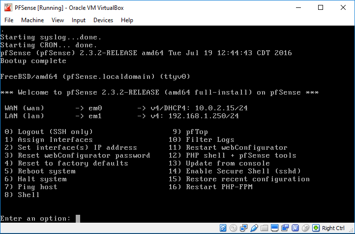
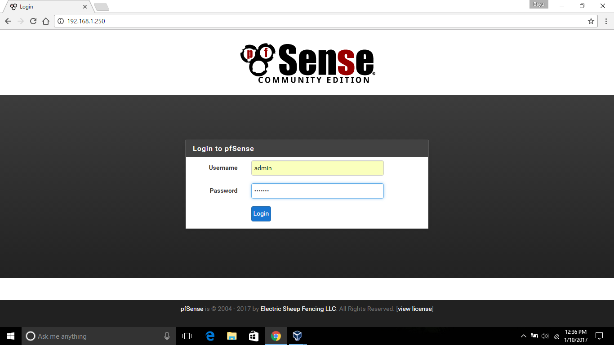
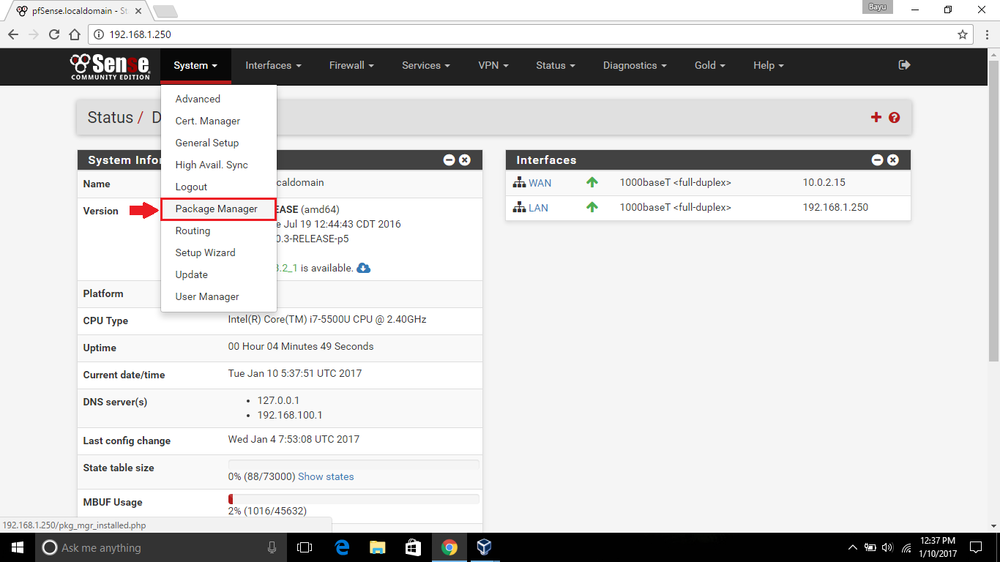
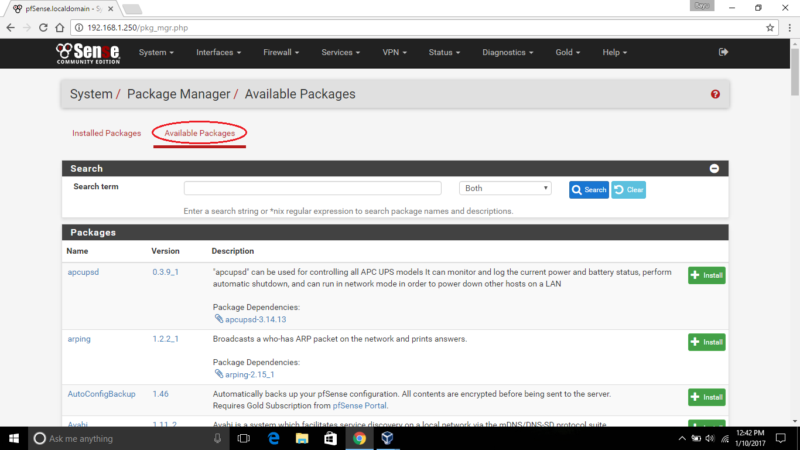
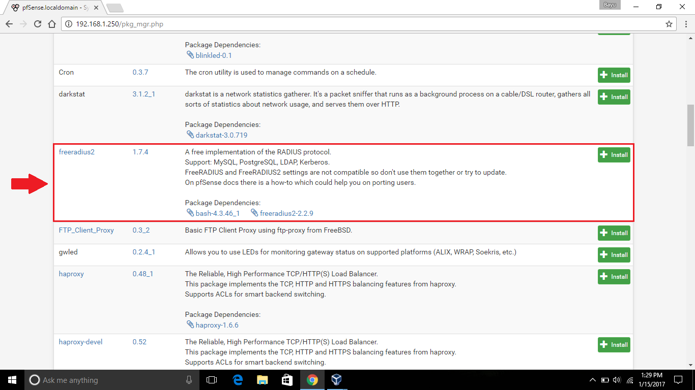
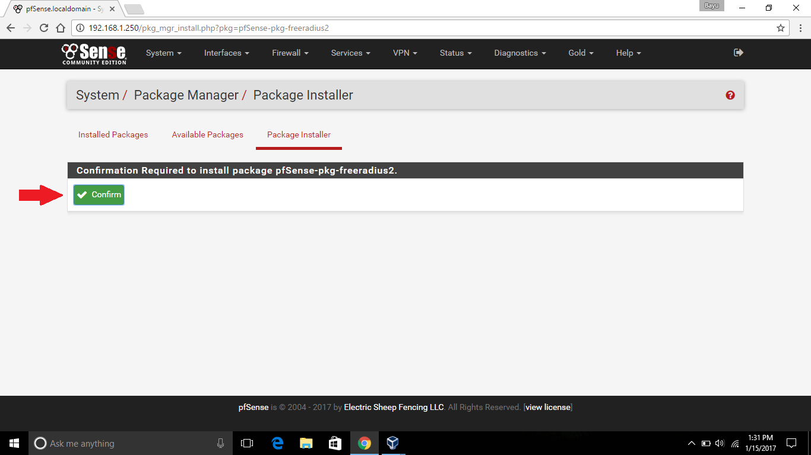
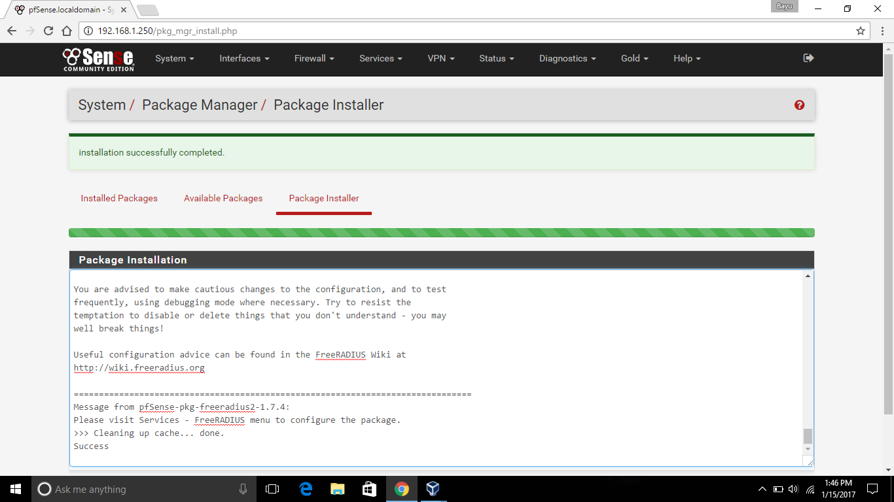
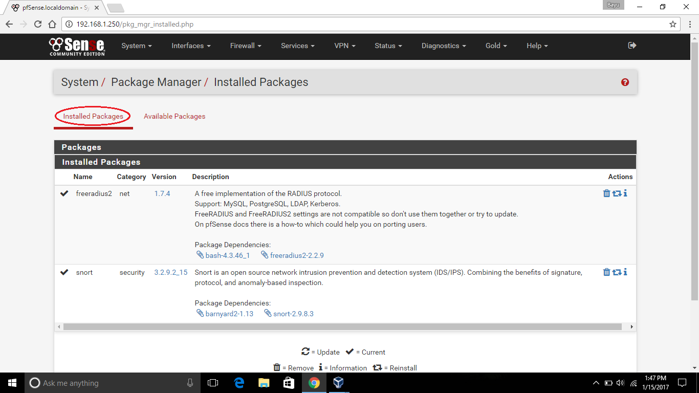

## Latar Belakang Masalah :
1. Remote Authentication Dial-In User Service (RADIUS)
2. Cara Kerja Remote Authentication Dial-In User Service (RADIUS)
3. Cara Instalasi FreeRadius Pada PFSense

## Remote Authentication Dial-In User Service (RADIUS)
Remote Authentication Dial-In User Service (RADIUS) adalah sebuah protokol keamanan jaringan yang memungkinkan server mengakses jaringan jarak jauh untuk berkomunikasi dengan server pusat untuk authentication dial-in pengguna dan authorization akses mereka ke sistem atau layanan yang diminta. RADIUS memungkinkan perusahaan menjaga profil pengguna di database pusat agar semua server dapat berbagi pada jaringan jarak jauh sehingga memberikan keamanan yang lebih baik. RADIUS dikembangkan oleh Livingston Enterprises, Inc. (sekarang dimiliki oleh Lucent).

## Cara Kerja Remote Authentication Dial-In User Service (RADIUS)
RADIUS menggunakan konsep AAA (Authentication, Authorization, Accounting) yaitu :
* Authentication 
Authentication digunakan untuk membatasi pengguna yang tidak memiliki hak akses agar tidak masuk ke dalam jaringan. Jika pengguna ingin masuk ke jaringan tersebut maka harus diidentifikasi terlebih dahulu agar administrator mengetahui apakah pengguna tersebut memiliki hak akses atau tidak untuk masuk. Metode yang paling umum digunakan untuk mengetahui pengguna yang mengakses jaringan adalah dengan login menggunakan password.
* Authorization 
Authorization adalah proses lanjutan dari authentication, yaitu memberikan batasan-batasan hak untuk mengakses jaringan, agar pengguna hanya mengakses sesuai hak akses yang dimilikinya. Metode yang paling sering digunakan untuk memberikan pembatasan ini adalah dengan menggunakan atribut yang dirangkai untuk menghasilkan kebijakan tentang hak akses pengguna yang telah disesuaikan dengan informasi yang ada di database.
* Accounting 
Accounting digunakan untuk mengetahui informasi berapa lama pengguna terkoneksi dengan jaringan, dan informasi berapa besar data transaksi komunikasi yang melalui jaringan tersebut. Informasi ini sangat berguna untuk pengguna dan administrator untuk membuat laporan pemakaian, menganalisis karakteristik jaringan, melakukan proses auditing, dan lain-lain.

## Cara Instalasi FreeRadius Pada PFSense
Langkah pertama jalankan pfSense pada virtualbox.

Kemudian buka pfSense pada browser dengan memasukkan IP Address LAN yang sesuai dengan virtualbox misalkan http://192.168.1.250, lalu masukkan username dan passwordnya.

Kemudian setelah masuk ke halaman utama pilih menu System, lalu pilih Package Manager.

Kemudian pada halaman Package Manager, pilih Available Packages.

Kemudian cari freeradius dan klik Install.

Kemudian klik Confirm untuk mengonfirmasi instalasi freeradius.

Kemudian tunggu proses instalasi sampai sukses.

Setelah itu lihat pada Installed Package, dan freeradius telah diinstal.

## Kesimpulan
Jadi, Remote Authentication Dial-In User Service (RADIUS) adalah sebuah protokol keamanan jaringan yang memungkinkan server mengakses jaringan jarak jauh untuk berkomunikasi dengan server pusat untuk authentication dial-in pengguna dan authorization akses mereka ke sistem atau layanan yang diminta. RADIUS menggunakan konsep AAA (Authentication, Authorization, Accounting).

## Saran
Diharapkan memahami materi dan praktikumnya secara mendetail dan perhatikan setiap langkah konfigurasi virtualbox dan proses instalasi FreeRadius dengan baik dan benar.
 
* Nama : Bayu Rahmad Azhari
* NPM : 1144125
* Kelas : 3C
* Prodi : D4 Teknik Informatika
* Kampus : Politeknik Pos Indonesia

Link Matakuliah : http://kampus.awangga.net/assignments/keamananjaringan2016

Referensi :
* http://searchsecurity.techtarget.com/definition/RADIUS
* http://www.cisco.com/c/en/us/support/docs/security-vpn/remote-authentication-dial-user-service-radius/12433-32.html

Scan Plagiarisme :
* https://drive.google.com/open?id=0B5FSMUsdCMU4QlU0NzhsNzRRUzA
* https://drive.google.com/open?id=0B5FSMUsdCMU4b29jTWhHRVZWVmc 

