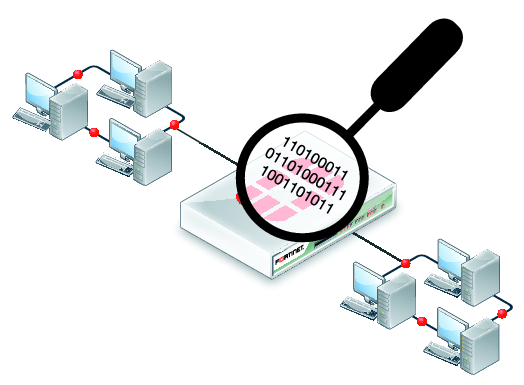

## Latar Belakang Masalah :
1. Sniffing Jaringan
2. Deteksi dan Pencegahan Sniffing

## Sniffing Jaringan
Sniffing jaringan adalah kegiatan penyadapan komunikasi pada jaringan yang sulit dicegah dengan memanfaatkan mode premicious pada Ethernet. Dan cara paling mudah untuk mengatasinya adalah dengan mengunakan aplikasi secure, seperti : ssh, ssl, secureftp dan lain sebagainya.

## Deteksi dan Pencegahan Sniffing
Cara mendeteksi dan mencegah sniffing pada jaringan adalah sebagai berikut :

1. Enkripsi
Enkripsi adalah suatu proses pengkodean data sehingga keamanan informasinya tetap terjaga dan tidak terbaca sebelum didekripsikan terlebih dahulu.

2. Post Security
Fungsi Post Security pada switch manageable adalah untuk memetakan port pada alamat tertenntu.

3. ARP Poisoning Detection Tools
Menggunakan ARP Poisoning Detection Tools adalah cara paling efisien untuk mendeteksi dan mencegah sniffing pada jaringan, dan dua contoh toolsnya adalah : ARP Watch dan Promiscan.

4. Menggunakan protocol yang aman
Contoh protocol aman HTTPS (Hypertext Transfer Protokol Secure).

## Kesimpulan
Jadi, sniffing jaringan adalah kegiatan penyadapan komunikasi pada jaringan yang sulit dicegah dengan memanfaatkan mode premicious pada Ethernet, dan tentu juga bisa di deteksi dan di cegah.

## Saran
Buat praktikum mudah-mudahan buat pertemuan selanjutnya materi dan praktikumnya dijelaskan lebih mendetail lagi.

* Nama : Bayu Rahmad Azhari
* NPM : 1144125
* Kelas : 3C
* Prodi : D4 Teknik Informatika
* Kampus : Politeknik Pos Indonesia

Link Matakuliah : http://kampus.awangga.net/assignments/keamananjaringan2016

Referensi : 
* http://ekocyber.heck.in/pengertian-sniffer.xhtml
* https://jarkomindonesia.wordpress.com/2012/10/01/tujuan-sniffing/ 

Scan Plagiarisme :
* https://drive.google.com/open?id=0B5FSMUsdCMU4bEdZbm5VLU9FSU0
* https://drive.google.com/open?id=0B5FSMUsdCMU4OFZyUlFWVzl5UU0 

