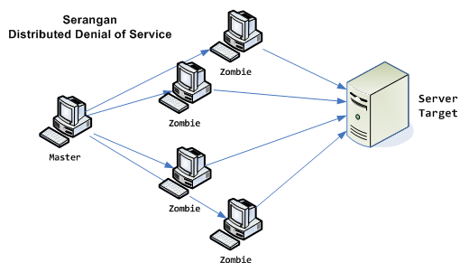

## Latar Belakang Masalah :
1. Denial of Service (DoS)
2. Distributed Denial of Service (DDoS)

## Denial of Service (DoS)
Denial of Service adalah upaya yang dilakukan penyerang untuk mengganggu fungsi normal dari sebuah sistem, dalam serangan DoS biasanya penyerang akan membebani server dengan melakukan permintaan akses melebihi kapasitasnya, sehingga server tidak sempat melayani permintaan yang lain.
Beberapa cara menghadapi serangan DoS :
* Mempertahankan firewall.
* Memanfaatkan filter router.
* Menonaktifkan jaringan yang tidak terpakai.
* Memiliki switch dengan monitoring otomatis untuk serangan DoS.
* Mengamati kinerja sistem yang teratur untuk mendapatkan data dasar dan menggunakannya untuk mengukur aktivitas yang tidak biasa.

## Distributed Denial of Service (DDoS)
Distributed Denial of Service adalah satu dari banyak penyerang yang terhubung untuk menyerang satu sistem tunggal, sehingga menyebabkan penolakan layanan untuk pengguna sistem yang ditargetkan. 
Ada 2 jenis serangan DDos :
* Network-centric attack yang membebani layanan dengan menggunakan bandwidth.
* Application-layer attack yang membebani layanan atau database dengan panggilan aplikasi.

## Kesimpulan
Jadi, Denial of Service adalah upaya yang dilakukan penyerang untuk mengganggu fungsi normal dari sebuah sistem dan Distributed Denial of Service adalah satu dari banyak penyerang yang terhubung untuk menyerang satu sistem tunggal.

## Saran
Pahami materi dan praktikumnya secara lebih mendetail lagi.
 
* Nama : Bayu Rahmad Azhari
* NPM : 1144125
* Kelas : 3C
* Prodi : D4 Teknik Informatika
* Kampus : Politeknik Pos Indonesia

Link Matakuliah : http://kampus.awangga.net/assignments/keamananjaringan2016

Referensi :
* http://www.pctools.com/security-news/what-is-denial-of-service/
* http://searchsecurity.techtarget.com/definition/distributed-denial-of-service-attack 

Scan Plagiarisme :
* https://drive.google.com/open?id=0B5FSMUsdCMU4N2RDdzMzRUxxNTQ
* https://drive.google.com/open?id=0B5FSMUsdCMU4ZlhtN0dMLTN1TEU 